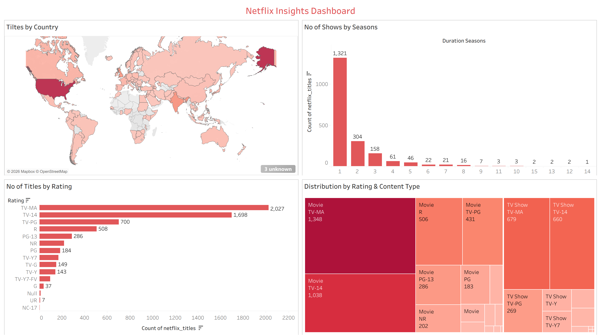

# Netflix Insights Dashboard 🎬

A data visualization project analyzing Netflix's global content library — exploring content distribution by country, maturity ratings, seasons, and content type using Tableau.

---

## 🔗 Live Dashboard

[View on Tableau Public](https://public.tableau.com/app/profile/shubham.gupta2025/viz/NetflixInsightsDashboard_17579528140600/Dashboard1)

---

## 📸 Dashboard Preview



---

## 📁 Project Structure

```
TABLEAU_NETFLIX_PROJECT/
├── data/
│   └── netflix_titles.xlsx        # Source dataset
├── tableau/
│   └── Netflix Insights Dashboard.twbx  # Tableau workbook
│   └── dashboard.png                    # Dashboard preview
│                 
├── README.md                      # Project overview (this file)
└── ANALYSIS.md                    # Detailed insights & recommendations
```

---

## 📊 Dashboard Overview

The dashboard is built on the Netflix Titles dataset (~6,200 titles) and contains 4 interactive charts:

| Chart | Description |
|---|---|
| 🗺️ Titles by Country | World map showing content production volume by country |
| 📺 No. of Shows by Seasons | Bar chart of TV Shows distributed by season count |
| ⭐ No. of Titles by Rating | Horizontal bar chart of titles grouped by maturity rating |
| 🟥 Distribution by Rating & Content Type | Treemap comparing Movies vs TV Shows across ratings |

---

## 🗃️ Dataset Details

| Field | Description |
|---|---|
| `type` | Movie or TV Show |
| `title` | Name of the content |
| `country` | Country of production |
| `rating` | Maturity rating (TV-MA, TV-14, R, etc.) |
| `release_year` | Year of release |
| `duration_minutes` | Runtime in minutes (Movies) |
| `duration_seasons` | Number of seasons (TV Shows) |
| `listed_in` | Genre/category |
| `cast` | Cast members |
| `director` | Director name |

---

## 🛠️ Tools Used

- **Tableau Desktop 2025.2** — dashboard building & visualization
- **Tableau Public** — publishing & sharing
- **Microsoft Excel** — data source format (.xlsx)
- **VS Code** — project management & GitHub workflow
- **Git & GitHub** — version control

---

## 💡 Key Takeaways

- The US dominates Netflix's content library with 35%+ of all titles
- Over 1,300 TV Shows have just 1 season — limited series are the norm
- TV-MA is the #1 rating category with 2,027 titles
- Movies outnumber TV Shows significantly, especially in mature categories

> For detailed chart-level insights and recommendations, see [analysis_report.md](analysis_report.md)

---

## 👤 Author

**Shubham Gupta**
[Tableau Public Profile](https://public.tableau.com/app/profile/shubham.gupta2025),
[LinkedIn](https://www.linkedin.com/in/theshubhamguptaa/)
